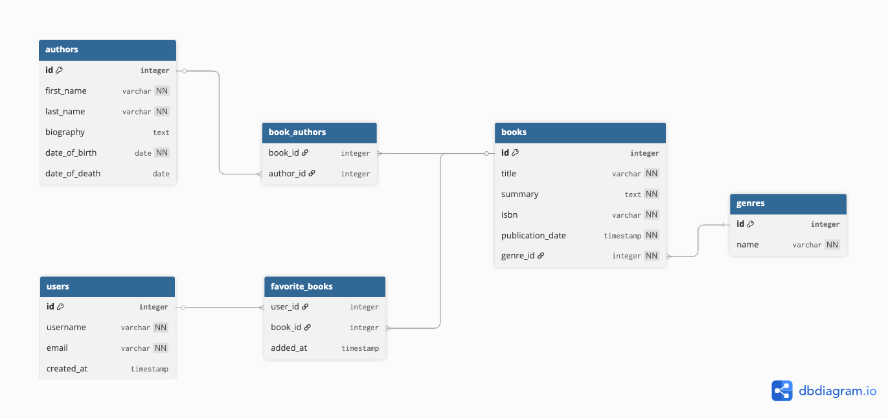

## Summary
An API for managing books and authors. The system
should allow users to add books and authors, view
the list of books, get detailed information about each book, edit, and
delete them.


## ER Diagram




## Installation

### Prerequisites
- Python 3.13+
- [uv](https://docs.astral.sh/uv/getting-started/installation/)
- Redis

### Setup

1. Clone the repository
```bash
   git clone <repo-url>
   cd <repo-name>
```

2. Install dependencies
```bash
   uv sync
```

3. Create `.env` file
```bash
   cp .env.example .env
```

4. Make migrations
```bash
   uv run python manage.py makemigrations
```

5. Run migrations
```bash
   uv run python manage.py migrate
```

6. Create Periodic tasks
```bash
uv run python scripts/setup_periodic_tasks.py
```

7. Load fixtures (optional)
```bash
   uv run python manage.py loaddata authors.json genres.json books.json
```

8. Start Celery worker
```bash
   uv run celery -A config worker -l info
```

9. Start Celery beat
```bash
   uv run celery -A config beat -l info
```

10. Start development server
```bash
   uv run python manage.py runserver
```

11. API is available at `http://localhost:8000/api/v1/`
12. Swagger UI is available at `http://localhost:8000/api/schema/swagger-ui/`


## Running with Docker

### Prerequisites
- [Docker](https://docs.docker.com/get-docker/)
- [Docker Compose](https://docs.docker.com/compose/install/)

### Setup

1. Clone the repository
```bash
   git clone <repo-url>
   cd <repo-name>
```

2. Create and fill `.env` file
```bash
   cp .env.example .env
```

3. Build and start containers
```bash
   docker compose up --build
```

4. Make migrations
```bash
    docker compose exec web python manage.py makemigrations
```

5. Run migrations
```bash
   docker compose exec web python manage.py migrate
```

6. Load fixtures (optional)
```bash
   docker compose exec web python manage.py loaddata authors.json genres.json books.json
```

7. Create Periodic tasks
```bash
   docker compose exec web python scripts/setup_periodic_tasks.py
```

8. API is available at `http://localhost:8000/api/v1/`
9. Swagger UI is available at `http://localhost:8000/api/schema/swagger-ui/`

